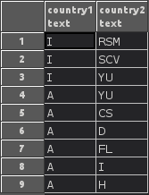
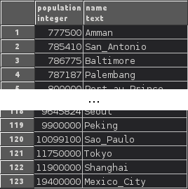
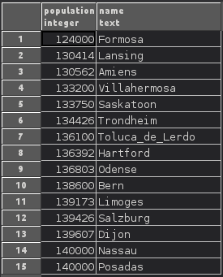
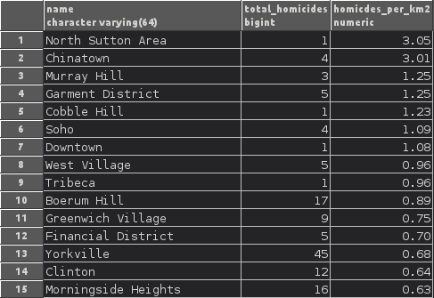

Cartographic Information Systems - Assignments
##############################################

Assignment 1 - Spatial Databases
================================

Task 1: SQL
-----------

List  countries with more than 20 cities
^^^^^^^^^^^^^^^^^^^^^^^^^^^^^^^^^^^^^^^^^
List all countries for which our test data contains more than 20 cities,
and return the number of cities for each such country.

.. code-block:: psql

    SELECT
        count(*),
        country.name
    FROM (
        city
        LEFT JOIN country ON city.c_id = country.c_id)
    GROUP BY
        country.name HAVING count(city.c_id) > 20;

.. image:: _static/img/cartoinfo/ex1_group_by.png
    :align: center

* ``SELECT`` selects one or several collumns from a dataset.
* ``COUNT`` calculates the number of entries returned
* ``LEFT JOIN`` joins a second dataset to the present one, keeping all entries
    from the original dataset (in this case *city*), and discarding all
    entries from the second that cannot be matched. This is done here to
    have full country names in the query result.
* ``GROUP BY`` is used to group rows by a certain condition (in this case
    *country.name*). It can be used in conjuncture with ``HAVING``
    to filter datasets based on aggregated statistics. In this example only
    groups (countries) that contain more than 20 cities are retained.

Select neighbors countries of Austria and Italy

    .. code-block:: psql

        SELECT *
        FROM neighbors
        WHERE country1 IN ('A', 'I');

* ``WHERE`` can be used to filter datasets based on conditions.
* ``IN`` checks wheter a value is in a list of values.

Select all cities with a population higher than the average population.
^^^^^^^^^^^^^^^^^^^^^^^^^^^^^^^^^^^^^^^^^^^^^^^^^^^^^^^^^^^^^^^^^^^^^^^

.. code-block:: psql

    SELECT population,
           name
    FROM city
    WHERE population >
            (SELECT avg(population)
             FROM city)
    ORDER BY population;

* ``AVG`` calculates the arithmethic mean of a collumn. There is also ``MAX`` for maximum, ``MIN`` for minimum, etc..

**Select all cities with a population between 120 000 and 140 000.**

.. code-block:: psql

    SELECT population,
           name
    FROM city
    WHERE population BETWEEN 120000 AND 140000
    ORDER BY population;

* ``BETWEEN`` checks wheter a value falls inside a range (closed interval)

Task 2: Spatial SQL
-------------------

For the spatial SQL queries I decided to use the NYC Crime datasets from
the postgis workshop example data. I imported them into postgres via qgis.
My first step was to query which columns are present in the tables:

.. code-block:: psql

    SELECT *
    FROM information_schema.columns
    WHERE table_schema = 'public'
        AND TABLE_NAME IN ('nyc_census_sociodata',
                           'nyc_homicides',
                           'nyc_neighborhoods',
                           'nyc_streets' )

(results not shown)

Identify the neighborhoods witht he most homicides
^^^^^^^^^^^^^^^^^^^^^^^^^^^^^^^^^^^^^^^^^^^^^^^^^^

Identifies the neighborhoods with the most homicides in total, an relativ per
area (in square kilometers)

.. code-block:: psql

    SELECT
       nyc_neighborhoods.name,
       count(nyc_homicides.geom) AS total_homicides,
       round(
       count(nyc_homicides.geom) / sum(st_area(nyc_neighborhoods.geom) / 1000000)
       ::NUMERIC, 2
       ) AS homicdes_per_km2
    FROM nyc_neighborhoods
    LEFT JOIN nyc_homicides ON st_contains(nyc_neighborhoods.geom, nyc_homicides.geom)
    GROUP BY nyc_neighborhoods.name
    ORDER BY homicdes_per_km2 DESC;

*   ``count(nyc_homicides.geom) / sum(st_area(nyc_neighborhoods.geom)/1000000)``
    returns a value of the type ``double precision``.
    This has to be typecast  to ``numeric`` for ``round`` to work.
*   ``st_contains`` checks if one geometry spatially containes another.
    This can be used as a join condition.
