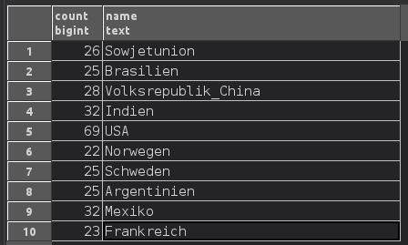

Cartographic Information Systems - Assignments
==============================================

Exercise 1 - Spatial Databases
------------------------------

List all countries for which our test data contains more than 20 cities, and
return the number of cities for each such country.

.. code-block:: psql

    SELECT COUNT(*),
           country.name
    FROM (city
          LEFT JOIN country ON city.c_id = country.c_id)
    GROUP BY country.name
    HAVING COUNT(city.c_id) > 20;

* ``SELECT`` selects one or several collumns from a dataset.
* ``COUNT`` calculates the number of entries returned
* ``LEFT JOIN`` joins a second dataset to the present one, keeping all entries
    from the original dataset (in this case *city*), and discarding all
    entries from the second that cannot be matched. This is done here to
    have full country names in the query result.
* ``GROUP BY`` is used to group rows by a certain condition (in this case
    *country.name*). It can be used in conjuncture with ``HAVING``
    to filter datasets based on aggregated statistics. In this example only
    groups (countries) that contain more than 20 cities are retained.
