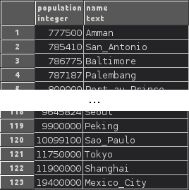
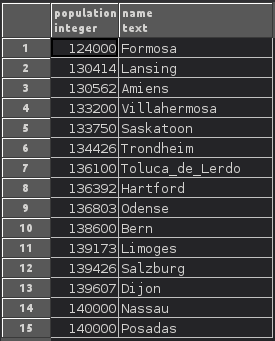
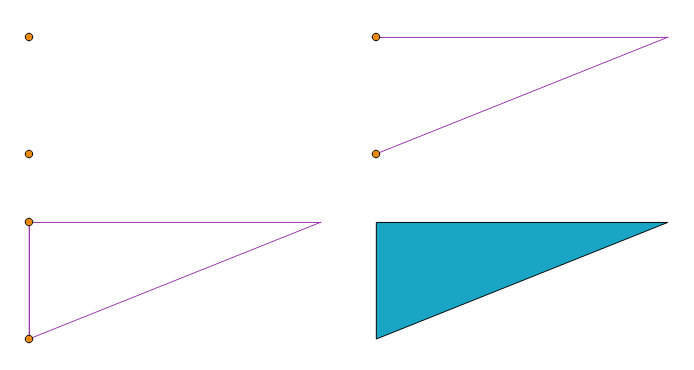
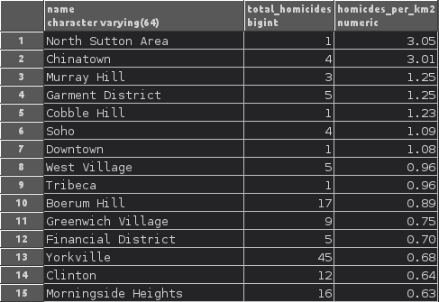
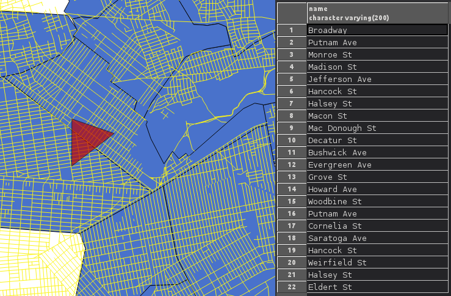
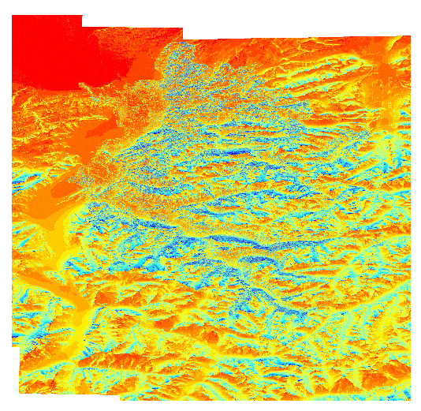
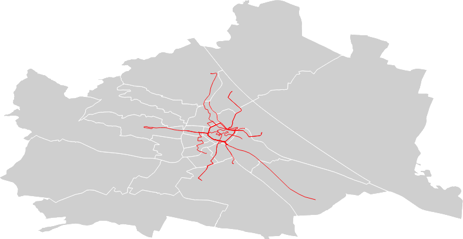
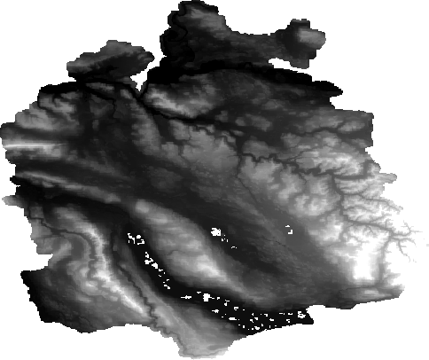

CIS - Assignments
#################

Assignment 1 - Spatial Databases
================================

Task 1: SQL
-----------

Simple queries
^^^^^^^^^^^^^^

Change owner of table:

.. code-block:: psql

    ALTER TABLE country OWNER TO Stefan;

Total population of all countries:

.. code-block:: psql

    SELECT SUM(population) FROM country;

        sum
    ------------
    4780008681
    (1 row)

Number of countries:

.. code-block:: psql

    SELECT count(*) FROM country;

     count
    -------
       176
    (1 row)

Average population of cities:

.. code-block:: psql

    SELECT ROUND(AVG(population)) FROM city;;

     round
    --------
    770951
    (1 row)

Select neighbors countries of Austria and Italy:

.. code-block:: psql

    SELECT *
    FROM neighbors
    WHERE country1 IN ('A', 'I');

.. image:: _static/img/cartoinfo/ex1_neighbors.png
    :align: center

* ``WHERE`` can be used to filter datasets based on conditions.
* ``IN`` checks wheter a value is in a list of values.

List  countries with more than 20 cities
^^^^^^^^^^^^^^^^^^^^^^^^^^^^^^^^^^^^^^^^^
List all countries for which our test data contains more than 20 cities,
and return the number of cities for each such country.

.. code-block:: psql

    SELECT
        count(*),
        country.name
    FROM (
        city
        LEFT JOIN country ON city.c_id = country.c_id)
    GROUP BY
        country.name HAVING count(city.c_id) > 20;

.. image:: _static/img/cartoinfo/ex1_group_by.png
    :align: center

* ``SELECT`` selects one or several columns from a dataset.
* ``COUNT`` calculates the number of entries returned.
* ``LEFT JOIN`` joins a second dataset to the present one, keeping all entries
    from the original dataset (in this case *city*), and discarding all
    entries from the second that cannot be matched. This is done here to
    have full country names in the query result.
* ``GROUP BY`` is used to group rows by a certain condition (in this case
    *country.name*). It can be used in conjuncture with ``HAVING``
    to filter datasets based on aggregated statistics. In this example only
    groups (countries) that contain more than 20 cities are retained.

Select all cities with higher than average population
^^^^^^^^^^^^^^^^^^^^^^^^^^^^^^^^^^^^^^^^^^^^^^^^^^^^^

.. code-block:: psql

    SELECT population,
           name
    FROM city
    WHERE population >
            (SELECT avg(population)
             FROM city)
    ORDER BY population;

* ``AVG`` calculates the arithmethic mean of a collumn. There is also ``MAX`` for maximum, ``MIN`` for minimum, etc..

Select cities with between 120 000 and 140 000 inhabitants
^^^^^^^^^^^^^^^^^^^^^^^^^^^^^^^^^^^^^^^^^^^^^^^^^^^^^^^^^^

.. code-block:: psql

    SELECT population,
           name
    FROM city
    WHERE population BETWEEN 120000 AND 140000
    ORDER BY population;

* ``BETWEEN`` checks if a value falls inside a range (closed interval).

Task 2: Spatial SQL
-------------------

For the spatial SQL queries I decided to use the NYC Crime datasets from
the PostGIS workshop example data. I imported them into my database with Qgis.
My first step was to query which columns are present in the tables:

.. code-block:: psql

    SELECT *
    FROM information_schema.columns
    WHERE table_schema = 'public'
        AND TABLE_NAME IN ('nyc_census_sociodata',
                           'nyc_homicides',
                           'nyc_neighborhoods',
                           'nyc_streets' );

    (results not shown)

Geometry construction
^^^^^^^^^^^^^^^^^^^^^

Manually add points to a table:

.. code-block:: psql

    INSERT INTO test_set(geom)
    VALUES
        (st_geomfromtext('POINT(590000 4506000)', 26918)),
        (st_geomfromtext('POINT(590000 4504000)', 26918));

Manually add a linestring to a table:

.. code-block:: psql

    INSERT INTO test_set(geom)
    VALUES
        (st_geomfromtext('LINESTRING(590000 4506000, 595000 4506000)', 26918)),
        (st_geomfromtext('LINESTRING(595000 4506000, 590000 4504000)', 26918));

Make a linestring from points:

.. code-block:: psql

    INSERT INTO test_set(geom)
    SELECT st_makeline(geom)
    FROM test_set
    WHERE geometrytype (geom) = 'POINT';

Merge linestrings and make them into a polygon:

.. code-block:: psql

    INSERT INTO test_set(geom)
    SELECT st_makepolygon(st_linemerge(st_union(geom)))
    FROM test_set
    WHERE geometrytype (geom) = 'LINESTRING';

Spatial Relationships
^^^^^^^^^^^^^^^^^^^^^

Select closest homicide to a location:

.. code-block:: psql

    SELECT ST_ASTEXT(ST_ClosestPoint(ST_UNION(nyc_homicides.geom),
                        ST_geomfromtext('POINT(590000 4506000)', 26918) ))
    FROM nyc_homicides;

    st_astext
    ------------------------------------------
    POINT(589803.785566978 4506210.40185214)
    (1 row)

Calculate distance of that point

.. code-block:: psql

    SELECT
        ST_Distance(
            ST_geomfromtext('POINT(590000 4506000)', 26918),
            ST_geomfromtext('POINT(589803.785566978 4506210.40185214)', 26918)
            );

    st_distance
    ------------------
    287.696095055454
    (1 row)

Identify the neighborhoods with the most homicides
^^^^^^^^^^^^^^^^^^^^^^^^^^^^^^^^^^^^^^^^^^^^^^^^^^

Identifies the neighborhoods with the most homicides in total, and relative per
area (in square kilometers)

.. code-block:: psql

    SELECT
       nyc_neighborhoods.name,
       count(nyc_homicides.geom) AS total_homicides,
       round(
       count(nyc_homicides.geom) / sum(st_area(nyc_neighborhoods.geom) / 1000000)
       ::NUMERIC, 2
       ) AS homicdes_per_km2
    FROM nyc_neighborhoods
    LEFT JOIN nyc_homicides ON st_contains(nyc_neighborhoods.geom, nyc_homicides.geom)
    GROUP BY nyc_neighborhoods.name
    ORDER BY homicdes_per_km2 DESC;

*   ``count(nyc_homicides.geom) / sum(st_area(nyc_neighborhoods.geom)/1000000)``
    returns a value of the type ``double precision``.
    This has to be typecast  to ``numeric`` for ``round`` to work.
*   ``st_contains`` checks if one geometry spatially contains another.
    This can be used as a join condition.

Identify streets that intersect an arbitrary polygon
^^^^^^^^^^^^^^^^^^^^^^^^^^^^^^^^^^^^^^^^^^^^^^^^^^^^

1. First I created a new empty table

.. code-block:: psql

    CREATE TABLE test_set (
      id   BIGSERIAL PRIMARY KEY,
      geom GEOMETRY
    );

2.  Into this table I digitized a triangle in Qgis. I did not tell Qgis to use
    the CRS of the NYC data, because I wanted to showcase coordinate transformation
    in PostGIS. For this I first queried the SRID of the CRS of
    ``nyc_neighborhoods``:

.. code-block:: psql

    select distinct ST_SRID(geom) FROM nyc_neighborhoods;

     st_srid
    ---------
      26918
    (1 row)

Using this information I could now transform the triangle from
WGS 84 (SRID 4326) to the CRS of the NYC data:

.. code-block:: psql

    SELECT ST_ASTEXT(ST_Transform(ST_SetSRID(geom,4326),26918))
    FROM test_set

And finally query which streets intersect the triangle:

.. code-block:: psql

    SELECT
        name
    FROM
        nyc_streets
    WHERE
        st_intersects(
            nyc_streets.geom,
            st_geomfromtext('
        		    POLYGON((591056.609774371 4505117.5172705,591063.751926372
        			4504014.8954651,592053.281732043 4504790.79481248,
        			591056.609774371 4505117.5172705))', 26918)
        		);

*   I could have directly used the ``geom`` from ``test_set`` for the intersect,
    but I wanted to demonstrated the use of ``st_geomfromtext`` as by the
    assignment instructions.
*   ``st_intersects`` checks whether two geometries intersect and returns
    TRUE / FALSE.

Assignment 2: Open Web standards
================================

WMS: Potential sunshine in Vorarlberg
-------------------------------------

WMS stands for Web Map Service. It is designed to provide georeferenced map images
to end-users. WMS reference: http://docs.geoserver.org/2.6.x/en/user/services/wms/reference.html

The county of Vorarlberg provides WMS access to a range of maps from the
Vorarlberg-Atlas. A list of available WMS services can be accessed at
https://www.vorarlberg.at/vorarlberg/bauen_wohnen/bauen/vermessung_geoinformation/weitereinformationen/services/wmsdienste.htm.
For this report I looked at the "Besonnung" (potential sunshine exposure) map.

GetCapabilities
^^^^^^^^^^^^^^^

http://vogis.cnv.at/mapserver/mapserv?map=i_besonnung_r_wms.map&version=1.3.0&service=wms&request=getcapabilities

+----------------------+-------------------------------------------------------------------------------------+
| Metadata (excerpt)                                                                                         |
+======================+=====================================================================================+
| WMS Version          | 1.3.0                                                                               |
+----------------------+-------------------------------------------------------------------------------------+
| Title                | Besonnung                                                                           |
+----------------------+-------------------------------------------------------------------------------------+
| Abstract             | Geodaten des Bundeslandes Vorarlberg als OGC-WMS                                    |
+----------------------+-------------------------------------------------------------------------------------+
| Keywords             | -missing-                                                                           |
+----------------------+-------------------------------------------------------------------------------------+
| Online Resource      | http://vogis.cnv.at/mapserver/mapserv?map=i_besonnung_r_wms.map                     |
+----------------------+-------------------------------------------------------------------------------------+
| Contact Person       | N.N. GIS-Techniker Landesamt für Vermessung und Geoinformation Vorarlberg           |
+----------------------+-------------------------------------------------------------------------------------+
| Fees                 | none                                                                                |
+----------------------+-------------------------------------------------------------------------------------+
| Access Constraints   | -missing-                                                                           |
+----------------------+-------------------------------------------------------------------------------------+
| Image Formats        | jpeg, gif, png, tiff, jpeg2000, png 8bit                                            |
+----------------------+-------------------------------------------------------------------------------------+
| Identify Formats     | text/html, application/vnd.ogc.gml, text/plain                                      |
+----------------------+-------------------------------------------------------------------------------------+
| Layer Count          | 26                                                                                  |
+----------------------+-------------------------------------------------------------------------------------+

+----------------------+-------------------------------------------------------------------------------------+
| Operations                                                                                                 |
+======================+=====================================================================================+
| GetCapabilities      | Metadata describing the WFS services and available operations                       |
+----------------------+-------------------------------------------------------------------------------------+
| GetMap               | Retrieve map image                                                                  |
+----------------------+-------------------------------------------------------------------------------------+
| GetFeatureInfo       | Retrieve underlying data (geometry, attributes)                                     |
+----------------------+-------------------------------------------------------------------------------------+
| GetLegendGraphic     | Retrieve a legend for the map (does not work correctly on this server)              |
+----------------------+-------------------------------------------------------------------------------------+

GetMap
^^^^^^

As indicated in the metadata retrieved via GetCapabilities, 26 Map layers are
available for the Vorarlberg sunshine data:

* 1x parent-layer
* 12x globstr. sun exposure per month (it is not documented what globstr. stands for)
* 12x potential sun exposure per month
* 1x potential sun exposure (whole year)

As an example, the following URL requests sun exposure data for the whole year,
projected in EPSG:4326 (WGS84) as a jpeg image file:

http://vogis.cnv.at/mapserver/mapserv?map=i_besonnung_r_wms.map&version=1.3.0&service=wms&request=getMap&Format=jpeg&SRS=EPSG:4326&VERSION=1.0.0&Layers=pbs_jahr&BBOX=9.4011800000000001,46.7554000000000016,10.3330000000000002,47.6585999999999999&width=600&height=600

    Sun exposure in Vorarlberg (whole year).

GetLegend
^^^^^^^^^

A GetLegend request only returns an empty picture for the Vorarlberg WFS. This is likely a
problem with the WMS server.
http://vogis.cnv.at/mapserver/mapserv?map=i_besonnung_r_wms.map&version=1.3.0&service=wms&request=getLegendGraphic&Format=png&VERSION=1.0.0&Layer=pbs_jahr

WFS: Open Government Data WFS Wien
----------------------------------

WFS stands for Web Feature Service. It provides discrete geospatial features to
the end-user. WFS reference: http://docs.geoserver.org/2.6.x/en/user/services/wfs/reference.html

The city of Vienna makes available a wide range of spatial data via WMTS, WMS and WFS.

GetCapabilities
^^^^^^^^^^^^^^^

http://data.wien.gv.at/daten/geo?version=1.1.0&service=WFS&request=GetCapabilities

+----------------------+-------------------------------------------------------------------------------------+
| Metadata (excerpt)                                                                                         |
+======================+=====================================================================================+
| WFS Version          | 1.1.0                                                                               |
+----------------------+-------------------------------------------------------------------------------------+
| Title                | Open Government Data WFS Wien                                                       |
+----------------------+-------------------------------------------------------------------------------------+
| Abstract             | This service provides access to online vector data of the City of Vienna, Austria.  |
+----------------------+-------------------------------------------------------------------------------------+
| Keywords             | WFS, Wien, Vienna, vector, government, data                                         |
+----------------------+-------------------------------------------------------------------------------------+
| Fees                 | http://creativecommons.org/licenses/by/3.0/at/deed.de                               |
+----------------------+-------------------------------------------------------------------------------------+
| Access Constraints   | http://data.wien.gv.at/nutzungsbedingungen                                          |
+----------------------+-------------------------------------------------------------------------------------+

+----------------------+-------------------------------------------------------------------------------------+
| Operations                                                                                                 |
+======================+=====================================================================================+
| GetCapabilities      | Metadata describing the WFS services and available operations                       |
+----------------------+-------------------------------------------------------------------------------------+
| DescribeFeatureType  | Supported feature types                                                             |
+----------------------+-------------------------------------------------------------------------------------+
| GetFeature           | Returns a selection of features (geometry + attributes)                             |
+----------------------+-------------------------------------------------------------------------------------+
| GetGmlObject         | Retrieve features and elements by ID                                                |
+----------------------+-------------------------------------------------------------------------------------+

GetFeature
^^^^^^^^^^

While WMS data can easily be accessed from a web browser, it is better to view
WFS data in a GIS application like QGIS.

GetFeature (city walking tracks):
http://data.wien.gv.at/daten/geo?SERVICE=WFS&VERSION=1.0.0&REQUEST=GetFeature&TYPENAME=ogdwien:SPAZIERLINIEOGD&SRSNAME=EPSG:31256

GetFeature (district borders):
http://data.wien.gv.at/daten/geo?SERVICE=WFS&VERSION=1.0.0&REQUEST=GetFeature&TYPENAME=ogdwien:BEZIRKSGRENZEOGD&SRSNAME=EPSG:31256

    City walking tracks and district borders of Vienna.

WCS: Digital Terrain Model & Digital Surface Model Canton Zürich
---------------------------------------------------------------

WCS stands for Web Coverage Service (WCS). It provides coverages (raw geospatial
data) to the end-user. WCS reference: http://docs.geoserver.org/2.6.x/en/user/services/wcs/reference.html

The official GIS-center of the canton Zürich provides access to a high
resolution DTM/DSM via WCS.

GetCapabilities
^^^^^^^^^^^^^^^

http://wms.zh.ch/DEMWCS?SERVICE=WCS&Version=1.0.0&Request=GetCapabilities

+----------------------+-------------------------------------------------------------------------------------+
| Metadata (excerpt)                                                                                         |
+======================+=====================================================================================+
| WFS Version          | 1.1.0                                                                               |
+----------------------+-------------------------------------------------------------------------------------+
| Title                | Digitales Höhenmodell                                                               |
+----------------------+-------------------------------------------------------------------------------------+
| Abstract             | Geodienst des GIS-ZH                                                                |
+----------------------+-------------------------------------------------------------------------------------+
| Keywords             | GIS-ZH, Geodaten                                                                    |
+----------------------+-------------------------------------------------------------------------------------+
| Fees                 | none                                                                                |
+----------------------+-------------------------------------------------------------------------------------+
| Access Constraints   | none                                                                                |
+----------------------+-------------------------------------------------------------------------------------+

+----------------------+-------------------------------------------------------------------------------------+
| Operations                                                                                                 |
+======================+=====================================================================================+
| GetCapabilities      | Metadate describing available data & WCS operations                                 |
+----------------------+-------------------------------------------------------------------------------------+
| DescribeCoverage     | Describe requested coverages                                                        |
+----------------------+-------------------------------------------------------------------------------------+
| GetCoverage          | Get the coverage in a well known file format                                        |
+----------------------+-------------------------------------------------------------------------------------+

DescribeCoverage & GetCoverage
^^^^^^^^^^^^^^^^^^^^^^^^^^^^^^

A DescribeCoverage retrieves metadata about a coverage. The following parameters
are required for designing a GetCoverage request:
  * Available coverages (dtm2014 in the example)
  * Available formats (tif in the example)
  * Available CRS and matching bounding boxes

DescribeCoverage: http://wms.zh.ch/DEMWCS?SERVICE=WCS&Version=1.0.0&Request=DescribeCoverage
GetCoverage: http://wms.zh.ch/DEMWCS?SERVICE=WCS&Version=1.0.0&Request=GetCoverage&CRS=EPSG:4326&BBOX=8.15828965399897,47.1430242738971,9.0386911908456,47.7138425493563&COVERAGE=dtm2014&WIDTH=800&HEIGHT=800&FORMAT=tif

    Digital surface model of the canton Zürich.
